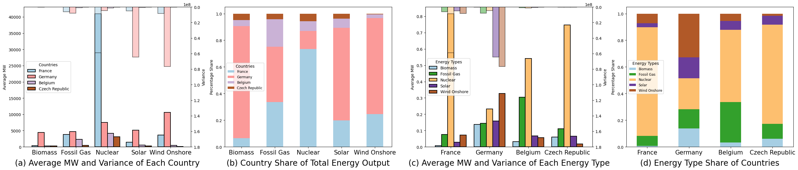
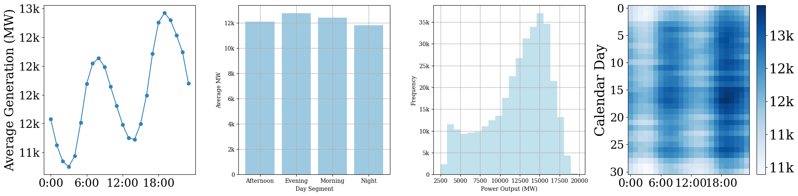
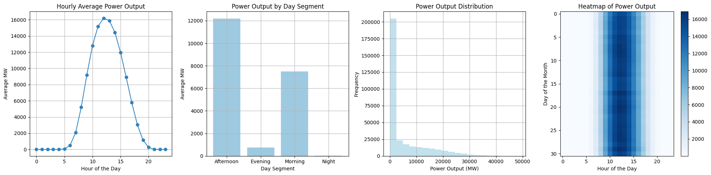

# ⚡ Real-E: The Largest Real-World Multivariate Electricity Forecasting Benchmark

Real-E is a comprehensive, high-resolution benchmark dataset for **multivariate time series forecasting in electricity systems**. It spans 10 years across 39 European countries, including over 74 electricity stations and 20+ energy categories. With rich metadata, non-stationary dynamics, and high temporal granularity, Real-E provides a rigorous foundation for developing and evaluating robust forecasting models.


---

## 📚 Background and Motivation

Electricity forecasting is essential for:
- Ensuring grid stability
- Integrating renewable energy
- Managing market operations and planning

While many recent models (especially Transformer and GNN-based ones) show promising results on synthetic or narrow-scope datasets, these models often **fail to generalize** in real-world scenarios due to:
- Limited spatial/temporal diversity in benchmarks
- Lack of multi-energy interaction modeling
- Ignoring dynamic correlation shifts

\data addresses these challenges by providing **the most comprehensive real-world electricity time series benchmark to date**.

---

##  Dataset

### 🧱 Dataset Overview

| Property                  | Description |
|---------------------------|-------------|
| 📍 Geography              | 39 European countries (10.18M km²) |
| 🕒 Duration               | 2014–2024 (10 years) |
| ⏱ Resolution             | 15 minutes to 1 hour |
| ⚡ Energy Types           | Solar, Wind, Hydro, Thermal, Nuclear, Coal, etc. |
| 📑 Data Sources           | ENTSO-E Transparency Platform |
| 🧭 Metadata               | Geolocation, Bidding Zone, Voltage Level, Plant Type |
| 🧵 Modalities             | Generation, Load, Market Pricing, Transmission, Balancing |


---

### How to Access the Dataset

We provide three versions of the dataset:

1. **OLD**: Retains the raw data without preprocessing.  
2. **V60**: Ensures that each time interval has at least 60% valid data.  
3. **O20**: Filters out variables with an overlapping rate below 20%.  

Each version includes variable-level visualization plots to support intuitive exploration and quality assessment.

 Dataset versions are organized into the following subdirectories:

- `BZN`: Data by bidding zones  
- `CTA`: Data by control areas  
- `CTY`: Data by countries  
- `Statistic`: Visual statistical analysis  

This multi-version design supports a wide range of forecasting and evaluation scenarios.

The dataset can be tracked and downloaded using the following Zenodo link:

- [Zenodo: Real-E (OLD O20 V60)](https://zenodo.org/records/15685930)


### Preprocessing 
In this repository we leverage the preprocessed datasets.





## 📈 Metrics and Analysis

To measure structural complexity and correlation dynamics, we introduce:

### 🔁 Temporal Graph Volatility (TGV)
Measures magnitude of correlation changes over time via Frobenius norm.

### 🧠 Graph Spectral Divergence (GSD)
Measures shifts in Laplacian eigenvalues to detect structural volatility.


---

## 🧪 Benchmarking Overview

We benchmark 20 models from different families:

### 🔢 Classical Methods
- ARIMA, S-ARIMA, VAR

### 🧠 MLP-based
- DLinear, N-Beats, TimeMixer

### 🔁 RNN/CNN
- LSTM, TCN, DeepGLO, SFM

### 🧠 Transformer-based
- Informer, Autoformer, FEDformer, Reformer

### 🌐 Graph Neural Networks
- Spectral GNNs: FourierGNN, LSGCN, StemGNN
- Spatial GNNs: MTGNN, TPGNN, WaveNet

### 📊 Results Summary

- **New Correlation Metrics** reveal temporal and structural shifts in energy systems.
- **Spatial GNNs** adapt better to non-stationary, policy-driven, and seasonal regimes. **FourierGNN and WaveNet** showed the best robustness across dynamic regimes.
- **Transformer models** struggle with heterogeneous, multi-energy, multi-national inputs.
- We release all data, preprocessing scripts, and model configs for reproducibility.


See full table in the paper for detailed MAE/RMSE rankings.

---

## 🚀 Quick Start

### 1. Clone the Repository

```bash
git clone https://github.com/ChenS676/Time-Series-Library.git
cd Time-Series-Library
```

### 2. Install Dependencies

```bash
pip install -r requirements.txt
```

---

## ⚙️ Training Examples

### 🧭 Spatial Graph Neural Network (GNN)

```bash
python train.py --data data/FRANCE --gcn_bool --adjtype doubletransition --addaptadj --randomadj --epochs 50
```

- `--gcn_bool`: Use GCN layers
- `--adjtype`: Type of adjacency matrix ("doubletransition" recommended)
- `--addaptadj`: Learnable adjacency
- `--randomadj`: Random init of graph structure

---

### 🔁 Reformer (Transformer-based)

```bash
python /EnergyTSF/run.py \
  --task_name long_term_forecast \
  --is_training 1 \
  --model_id Reformer_test \
  --model Reformer \
  --data Opennem \
  --data_path Germany_processed_0.csv \
  --features M \
  --seq_len 12 --label_len 12 --pred_len 12 \
  --enc_in 16 --dec_in 16 --c_out 16 \
  --des 'debug_run' --itr 1
```

- `seq_len`, `label_len`, `pred_len`: Input-output time window
- `enc_in`, `dec_in`, `c_out`: Number of input/output features
- `itr`: Repeat experiment for robustness

---


## 📬 Contact

For questions or contributions, please raise an issue or contact the maintainer.

