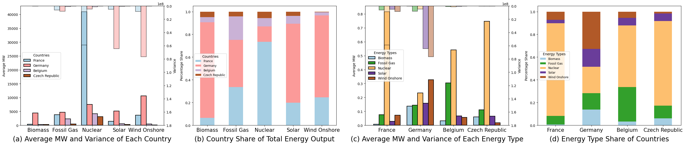
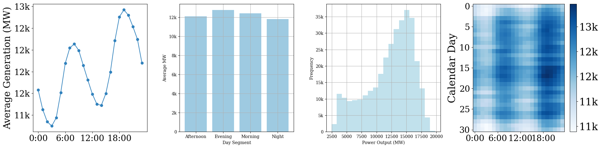
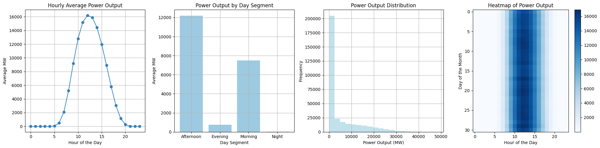

# Real-E: The Largest Real-World Multivariate Electricity Forecasting Benchmark

Real-E is a comprehensive, high-resolution benchmark dataset for **multivariate time series forecasting in energy systems**. It spans 10 years across 39 European countries, including over 74 electricity stations and 20+ energy categories. With rich metadata, non-stationary dynamics, and high temporal granularity, Real-E provides a rigorous foundation for developing and evaluating robust forecasting models.


##  Dataset

We employ two key metrics—\textbf{overlapping rate} and \textbf{valid percentage}—to assess temporal alignment and data completeness across features. Guided by these metrics, we provide three dataset versions: the \textbf{OLD} version retains raw data with minimal filtering for robustness testing; the \textbf{V60} version ensures that each time interval has at least 60% valid data, offering improved reliability without overly restricting coverage; the \textbf{O20} version filters out variables with an overlapping rate below 20%, resulting in a temporally consistent and well-aligned subset. We also provide variable-level visualization plots for each sub-dataset to support intuitive exploration and quality assessment. This multi-version design supports a wide range of forecasting and evaluation scenarios.

### 🧱 Dataset Overview 

| Category     | Name                    | Duration | Resolution | Length   | EC  | Countries |
|--------------|-------------------------|----------|------------|----------|-----|-----------|
| **Generation** | Actual-ByType            | 9.5 y    | 15 min     | >330k    | 20  | 39        |
|              | Actual-ByUnit             | 9.5 y    | 1 hour     | ~8.7k    | 20  | 39        |
|              | Renewables-Forecast       | 9.5 y    | 15 min     | >330k    | 3   | 39        |
|              | Capacity-Annual           | 9.5 y    | 1 year     | ~10      | 20  | 39        |
| **Load**     | Actual                   | 9.5 y    | 15 min     | >330k    | 20  | 39        |
|              | Forecast-WeekAhead       | 9.5 y    | 1 day      | ~3.4k    | 20  | 39        |
| **Market**   | Price-QuarterHourly       | 9.5 y    | 15 min     | >330k    | 20  | 39        |
|              | Price-Hourly              | 9.5 y    | 1 hour     | ~8.7k    | 20  | 39        |
| **Transmission** | Capacity-Forecast     | 9.5 y    | 1 hour     | ~8.7k    | 20  | 39        |
|              | Flow-Actual              | 9.5 y    | 1 hour     | ~8.7k    | 20  | 39        |
| **Balancing**| Energy-Activated         | 9.5 y    | 15 min     | >330k    | 20  | 39        |
|              | System-Imbalance         | 9.5 y    | 1 hour     | ~8.7k    | --  | 39        |


### Preprocessing 

We provide three versions, which keep 100% original time series, less than 60% and 20% missing value respectively. 

1. **Original**: Retains the raw data.  
2. **V60**: Ensures that each time interval has at least 60% valid data.  

Dataset versions are organized into the following subdirectories:

#### Spatial Dimensions

Real-E supports three spatial aggregation levels, offering flexible granularity for various forecasting and analysis tasks:

- `BZN` – **Bidding Zone Level**
  - Represents electricity market regions where prices are uniform.
  - Closely tied to market operations and congestion management.
  - Useful for **forecasting market-related variables** such as generation, consumption, and cross-border flows.
  - Example: `BZN|DE-LU` (Germany–Luxembourg bidding zone), `BZN|FR` (France).
  - A single country may have multiple BZNs, or several countries may share one (e.g., DE-LU).

- `CTA` – **Control Area Level**
  - Reflects the **operational boundaries** of Transmission System Operators (TSOs).
  - Ideal for studying **grid stability, dispatching, and load balancing**.
  - Example: `CTA|50Hertz`, `CTA|Amprion`, `CTA|RTE`.
  - Suitable for tasks involving transmission, balancing, or grid-centric modeling.

- `CTY` – **Country Level**
  - National-level aggregation of energy data.
  - Simplifies modeling while maintaining sufficient realism for macro-level analysis.
  - Example: `CTY|DE` (Germany), `CTY|FR` (France).
  - Recommended for **baseline models**, policy simulations, or when comparing nations.

#### Visualization

- `Statistic`: Visual statistical analysis
Each version includes variable-level visualization plots to support intuitive exploration and quality assessment. 

This multi-version design supports a wide range of forecasting and evaluation scenarios.

We also publish the preprocessed dataset in [Zenodo: Real-E (OLD O20 V60)](https://zenodo.org/records/15685930)


### Preprocessing 
In this repository we leverage the preprocessed datasets.








## 🧪 Benchmarking Overview

We benchmark 20 models from different families: We evaluate a comprehensive set of models, including classical methods (ARIMA, S-ARIMA, VAR), MLP-based approaches (DLinear, N-Beats, TimeMixer), RNN/CNN architectures (LSTM, TCN, DeepGLO, SFM), Transformer-based models (Informer, Autoformer, FEDformer, Reformer), and Graph Neural Networks—both spectral (FourierGNN, LSGCN, StemGNN) and spatial (MTGNN, TPGNN, WaveNet).


### Results Summary 
Till Juni 2025, the top three models for five different tasks are:

We conduct **multivariate time series forecasting** on the Real-E dataset with a **fixed prediction horizon of 12** time steps.

- **Top-performing class:** `spatial-based models` outperform other categories on average.

| Rank | Model        |
|------|--------------|
| 🥇 1st | [**GWaveNet**]          |
| 🥈 2nd | [**MTGNN**]             |
| 🥉 3rd | [**TPGNN**]             |

These models consistently achieved the lowest forecasting errors (MAE & RMSE) across multiple Real-E subsets, demonstrating strong generalization on large-scale, high-variance electricity data.

## 🚀 Quick Start

### 1. Clone the Repository

```bash
git clone https://github.com/YueW26/Real-E.git
```

### 2. Install Dependencies

```bash
pip install -r requirements.txt
```

---

## ⚙️ Training Examples

### 🧭 Spatial Graph Neural Network (GNN)

```bash
python train.py --data data/FRANCE --gcn_bool --adjtype doubletransition --addaptadj --randomadj --epochs 50
```

- `--gcn_bool`: Use GCN layers
- `--adjtype`: Type of adjacency matrix ("doubletransition" recommended)
- `--addaptadj`: Learnable adjacency
- `--randomadj`: Random init of graph structure

---

### 🔁 Reformer (Transformer-based)

```bash
python /EnergyTSF/run.py \
  --task_name long_term_forecast \
  --is_training 1 \
  --model_id Reformer_test \
  --model Reformer \
  --data Opennem \
  --data_path Germany_processed_0.csv \
  --features M \
  --seq_len 12 --label_len 12 --pred_len 12 \
  --enc_in 16 --dec_in 16 --c_out 16 \
  --des 'debug_run' --itr 1
```

- `seq_len`, `label_len`, `pred_len`: Input-output time window
- `enc_in`, `dec_in`, `c_out`: Number of input/output features
- `itr`: Repeat experiment for robustness

---


## Contact

For questions, suggestions, or contributions, please feel free to open an issue on GitHub or contact the maintainer via email at: **Joellawang2013@gmail.com**

